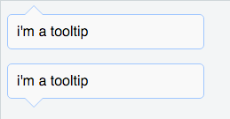

# 用CSS实现tooltip arrow的效果

***

Bootstrap 组件库中有个弹出框组件： [bootstrap popover]。它的样子类似于这样：



其中指向的三角形是用纯CSS实现的。这里把这个三角形的CSS代码剥离出来讲解。

先讲下实现的原理。我们需要两个纯色的三角形，一个是边框的颜色，另一个是内容主题的背景色，第二个比第一个稍微小1px。然后把第二个三角形覆盖到第一个三角形上，就只能看到1px的边框，也就是上图里的三角形。

tooltip的HTML代码如下（三角形指向朝下）：

```
 <div class="tooltip bottom">
    <p>i'm a tooltip</p>
    <div class="arrow"></div>
 </div>

```

先给出tooltip的式样：


```
// tooltip的样式
.tooltip {
    position:relative;
}

.tooltip p {
    padding:10px;
    background-color:#f9f9f9;
    border:solid 1px #a0c7ff;
    border-radius:5px;
    width: 200px;
}
```

注意tooltip的 `position: relative`。 因为arrow相对于父节点偏移的，用绝对布局+父节点relative可以很方便的指定arrow相对于父节点的偏移位置。

接下来要用到:after伪元素，因为需要两个三角形。div一个，:after伪元素一个。先指定这两个三角形共通的css样式：

```
// arrow的默认式样，绝对布局，边框透明。
.arrow, .arrow:after {
    position: absolute;
    display: block;
    width: 0;
    height: 0;
    border-color: transparent;
    border-style: solid;
}
```

接下来分别画出这两个三角形。这里用到一个小技巧：`border-top-color: #a0c7ff;border-width:10px;`在元素size为0的情况下会形成一个宽20px，高10px，颜色为#a0c7ff 的三角形。然后需要做的就是调整两个三角形的位置。

注意这里css selector的权重比上面的高，可以覆盖border-color的css样式。

```
// outer arrow。
.tooltip.bottom > .arrow {
    bottom:-20px;
    left:20px;
    border-top-color: #a0c7ff;
    border-width:10px;
}

// inner arrow
.tooltip.bottom > .arrow:after {
    content: ' ';
    bottom:-9px;
    left:-10px;
    border-top-color:#f9f9f9;
    border-width:10px;
}
```

示例：[JSFiddle]

[bootstrap popover]: http://v3.bootcss.com/javascript/#popovers
[JSFiddle]:https://jsfiddle.net/Andydonttalk/dmht200s/
