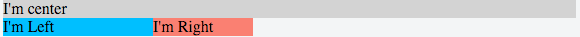
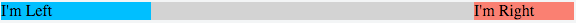
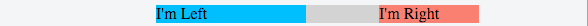
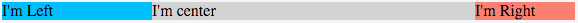

# 三列布局技术

***

三列布局技术是非常经典的布局，左边菜单栏，中间内容主体，右边广告栏或者其他。关于三列布局有两种非常经典的实现方式：圣杯布局和双飞燕布局。这篇文章主要就介绍这两种布局的实现细节，在最后介绍如何用更加现代的Flex布局去实现。

关于三列布局实现的基本要求：

- 中间列要在html中处在在前面，这样会优先得到解析和渲染
- 两边列固定宽度，中间列宽度自适应。

下面我们就开始介绍具体实现细节。


## 圣杯布局

下面就是三列布局最基础的html，其中center column是处在最前面的。

```
   <div class="container">
        <div class="center column">
            I'm center
        </div>
        <div class="left column">
            I'm Left
        </div>
        <div class="right column">
            I'm Right
        </div>
    </div>
```

- 首先让这个三列都浮动起来，中间宽度100%，两边宽度固定

```
.column{ float: left; }
.center { width: 100%; }
.left { width: 150px; }
.right { width: 100px; }
```


- 给left和right设置负边距，让这三列水平排列

```
.left { margin-left: -100%; }
.right { margin-left: -100px; }
```


- 给主container设置padding

```
.container { padding: 0 100px 0 150px; }
```


- 利用相对布局把左右栏移动到合适的位置

```
.column{ position: relative; }
.left { right: 150px }
.right { left: 100px; }
```


通过以后这四个步骤就实现了三列布局的效果，而这就是经典的圣杯布局。

它之所以被称作是圣杯布局，据说是想要实现完美的三列布局，同时兼容所有的浏览器实现，是一件可望而不可即的东西，就想传说中的圣杯一样。这里不去讨论这个布局的由来，以及浏览器的兼容情况等，有兴趣的同学可以去参考文章末尾的链接。

完整示例请参考：[圣杯布局]

## 双飞燕布局

双飞燕布局在圣杯布局的基础上做了改良。前面两步是一样的，然后给中间列嵌套个div，给这个div设置必要的margin。这样可以实现同样的效果。


```
	<div class="center column">
    	<div class="wrapper">
            I'm center
        </div>
    </div>
    
    .wrapper {
    	margin: 0 100px 0 150px;
    }
```
可以看出双飞燕布局以多一个div的代价，使得代码更加容易理解和扩展。

圣杯布局的思想是把左右边栏通过相对布局推到对应的位置，而双飞燕布局利用额外的div将中间栏直接缩小到合适的宽度。

具体示例请参考：[双飞翼布局]

##三列等高

现在这三列的高度是由它们内部的内容决定的，那么如何让这列拥有同样的高度呢？这里需要用到一个trick：

```
.container {
    overflow: hidden;
}

.column {
    padding-bottom: 20000px;
    margin-bottom: -20000px;
}
```
给column设置无限大的padding和负margin，这样会占满全屏幕。然后设置container的overflow为hidden，以最高的column为基准，多出来的padding都截掉。这样就可以实现三列等高的效果。


## Flex布局

Flex布局技术是CSS3中提出的概念，它的弹性布局方式能够按需适配不同的屏幕大小和设备类型等，跟移动端主流的布局技术比较相似，是一种更加现代的布局技术。

这里介绍下如何通过Flex实现三列布局的效果:

```
.container {
    display: flex;
    flex-flow: row wrap;
}
.left {
    flex: 0 0 150px;
    order: 1;
}
.center {
    flex: 1 auto;
    order: 2;
}
.right {
    flex: 0 0 100px;
    order: 3;
}
```

非常简洁，直观。实际上Flex布局的更大优势在于适配不同屏幕比的布局上，这里有一个mobile first三列自适应布局的列子：[Flex三列自适应布局]

## 总结

三列布局是非常经典的网站布局方式，而圣杯布局和双飞燕布局是其中最流行的实现方式。而随着web技术的发展，和CCS3布局方式的引入，我们能够用Flex更加方便的去实现三列布局，同时能更好的适应如今多屏的复杂环境。

参考资料：

- [In Search of the Holy Grail]
- [Equal Height Columns]
- [双飞翼布局介绍]
- [A complete guide to Flexbox]

[圣杯布局]: https://jsfiddle.net/tanzhenxin/489Lh2gg/
[双飞翼布局]: https://jsfiddle.net/tanzhenxin/0sk8jvns/
[Flex三列自适应布局]:(https://jsfiddle.net/tanzhenxin/nL0rshj8/)
[Equal Height Columns]: http://www.positioniseverything.net/articles/onetruelayout/equalheight
[In Search of the Holy Grail]:http://alistapart.com/article/holygrail
[双飞翼布局介绍]:http://www.imooc.com/wenda/detail/254035
[A complete guide to Flexbox]:https://css-tricks.com/snippets/css/a-guide-to-flexbox/